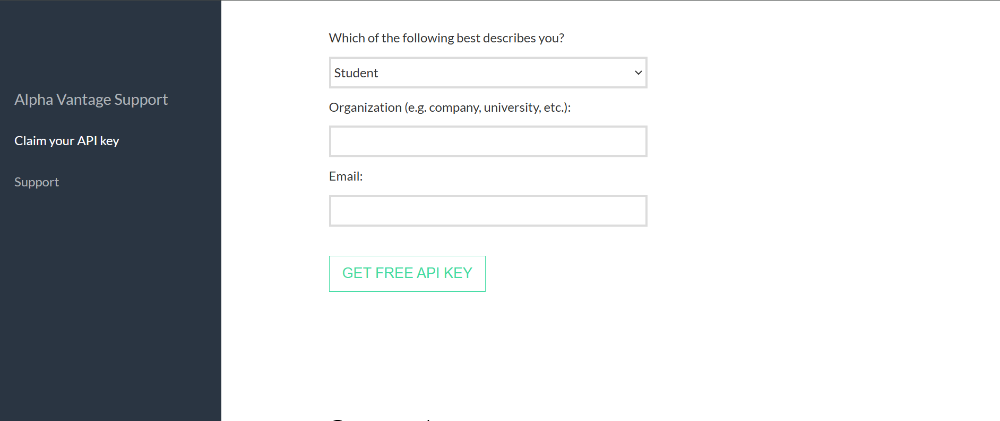

# SP500 Components Historical Financial Statements Data

## Overview

This project allows you to fetch historical financial data for companies listed in the S&P 500 index using the Alpha Vantage API. The data includes income statements, balance sheets, and cash flow statements.

---

## Installation

1. Clone this repository:
   ```bash
   git clone https://github.com/McKingN/StockOptions-Pricing-With-Binomial-Tree-Model-in-Cpp.git
   cd StockOptions-Pricing-With-Binomial-Tree-Model-in-Cpp
   ```

2. Install the required dependencies:
   ```bash
   pip install -r requirements.txt
   ```

---

## Obtaining an API Key from Alpha Vantage

1. Visit the Alpha Vantage website: [Alpha Vantage](https://www.alphavantage.co/).
2. Click on **"Get free API key"**.
3. Fill in the required information and click **"GET FREE API KEY"**.  
   You should be redirected to a page displaying your API key, similar to the example below:  
   

4. Copy the generated API key.

---

## Updating the API Key

1. Open the `main.py` file in your code editor.
2. Replace the existing API key with the one you copied.

---

## Running the Project

To fetch and process the financial data, run the `main.py` file:
```bash
python main.py
```

---

## Contributing

1. Fork the repository.
3. Commit your changes:
   ```bash
   git commit -m "Add your message here"
   ```
4. Push to the branch master:
   ```bash
   git push origin master
   ```
5. Open a pull request.

---

## Repository

Find the full project on GitHub: [SP500-HistoricalFinancialStatements](https://github.com/McKingN/SP500-HistoricalFinancialStatements.git)

---

Thank you for your help on this project!
